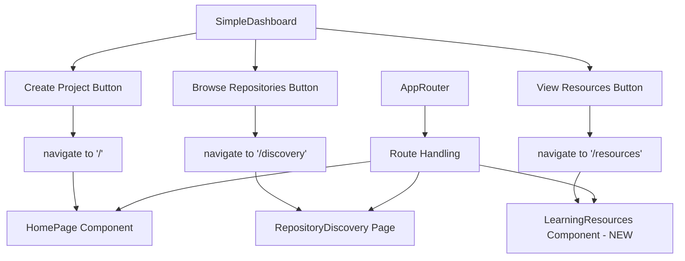

# Design Document: Dashboard Button Functionality Fix

## Overview

This design document outlines the implementation approach for fixing the non-functional dashboard buttons in the Reverse Engineer Coach application. The solution involves adding proper onClick handlers to the three main action buttons, implementing a new learning resources page, and ensuring seamless integration with the existing routing and component architecture.

The fix addresses a critical user experience issue where authenticated users cannot access key application features from the dashboard, effectively blocking the primary user workflows.

## Architecture

### Current Architecture Analysis

The application uses a hash-based routing system implemented in `AppRouter.tsx` with the following key components:

- **SimpleDashboard**: Main dashboard component with static buttons
- **AppRouter**: Hash-based router handling navigation between pages
- **Navigation Helper**: `navigate()` function for programmatic navigation
- **Existing Pages**: HomePage (project creation), ProjectDashboard (project management), RepositoryDiscovery (repository browsing)

### Proposed Architecture Changes



### Integration Points

1. **Button Event Handlers**: Add onClick handlers to existing button components
2. **Route Registration**: Register new routes in AppRouter for discovery and resources pages
3. **Component Creation**: Create new LearningResources component
4. **Navigation Flow**: Ensure proper navigation state management

## Components and Interfaces

### Modified Components

#### SimpleDashboard Component
```typescript
interface DashboardButtonProps {
  onClick: () => void;
  children: React.ReactNode;
  variant?: 'primary' | 'secondary';
  className?: string;
  disabled?: boolean;
  loading?: boolean;
}

// Enhanced button handlers
const handleCreateProject = () => {
  navigate('/');
};

const handleBrowseRepositories = () => {
  navigate('/discovery');
};

const handleViewResources = () => {
  navigate('/resources');
};
```

#### AppRouter Component
```typescript
// New route handlers
if (currentPath === '/discovery') {
  return (
    <SimpleErrorBoundary componentName="RepositoryDiscoveryPage">
      <SimpleProtectedRoute>
        <SimpleLayout showNavigation={true}>
          <RepositoryDiscoveryPage />
        </SimpleLayout>
      </SimpleProtectedRoute>
    </SimpleErrorBoundary>
  );
}

if (currentPath === '/resources') {
  return (
    <SimpleErrorBoundary componentName="LearningResourcesPage">
      <SimpleProtectedRoute>
        <SimpleLayout showNavigation={true}>
          <LearningResourcesPage />
        </SimpleLayout>
      </SimpleProtectedRoute>
    </SimpleErrorBoundary>
  );
}
```

### New Components

#### LearningResourcesPage Component
```typescript
interface LearningResource {
  id: string;
  title: string;
  description: string;
  category: ResourceCategory;
  type: 'tutorial' | 'documentation' | 'article' | 'video' | 'example';
  url: string;
  difficulty: 'beginner' | 'intermediate' | 'advanced';
  tags: string[];
  estimatedTime?: string;
  isExternal: boolean;
}

interface ResourceCategory {
  id: string;
  name: string;
  description: string;
  icon: string;
}

interface LearningResourcesPageProps {
  className?: string;
}
```

#### RepositoryDiscoveryPage Component
```typescript
interface RepositoryDiscoveryPageProps {
  initialConcept?: string;
  className?: string;
}

// Wrapper component that integrates existing RepositoryDiscovery
// with page-level functionality
```

## Data Models

### Learning Resources Data Structure

```typescript
interface ResourcesData {
  categories: ResourceCategory[];
  resources: LearningResource[];
  featuredResources: string[]; // Resource IDs
  recentlyAdded: string[]; // Resource IDs
}

interface ResourceFilter {
  category?: string;
  type?: string;
  difficulty?: string;
  tags?: string[];
  searchQuery?: string;
}
```

### Navigation State

```typescript
interface NavigationState {
  currentPath: string;
  previousPath?: string;
  navigationSource?: 'dashboard' | 'direct' | 'back_button';
}
```

## Correctness Properties

*A property is a characteristic or behavior that should hold true across all valid executions of a system-essentially, a formal statement about what the system should do. Properties serve as the bridge between human-readable specifications and machine-verifiable correctness guarantees.*

### Property 1: Dashboard Button Navigation
*For any* dashboard button (Create Project, Browse Repositories, View Resources), clicking the button should navigate to the correct corresponding route and render the expected page component.
**Validates: Requirements 1.1, 1.2, 2.1, 2.2, 3.1, 3.2**

### Property 2: Authentication State Persistence
*For any* navigation triggered from dashboard buttons, the user authentication state (tokens, user data) should remain intact after navigation completes.
**Validates: Requirements 1.3, 2.3, 3.3**

### Property 3: Button Visual Feedback
*For any* dashboard button interaction (click, hover, focus, disabled), the button should provide appropriate visual feedback through CSS class changes or loading states.
**Validates: Requirements 1.4, 2.4, 3.4, 4.1, 4.2, 4.3, 4.4**

### Property 4: Keyboard Navigation Accessibility
*For any* dashboard button, keyboard navigation (Tab, Enter, Space) should work equivalently to mouse interactions and maintain proper focus order.
**Validates: Requirements 5.1, 5.2**

### Property 5: Screen Reader Accessibility
*For any* dashboard button and its state changes, screen readers should receive proper aria-labels, roles, and state announcements.
**Validates: Requirements 5.3, 5.4**

### Property 6: Error Handling Resilience
*For any* navigation or interaction failure, the system should display appropriate error messages and maintain dashboard functionality without complete failure.
**Validates: Requirements 6.1, 6.2, 6.3, 6.4**

### Property 7: Learning Resources Page Functionality
*For any* access to the learning resources page, the page should display categorized content with search, filtering, and proper external link handling.
**Validates: Requirements 7.1, 7.2, 7.3, 7.5**

### Property 8: Repository Discovery Integration
*For any* repository discovery workflow initiated from the dashboard, the existing RepositoryDiscovery component should integrate properly with API endpoints and project creation flow.
**Validates: Requirements 8.1, 8.2, 8.3**

### Property 9: State Persistence Across Navigation
*For any* navigation between dashboard and other pages, relevant application state (discovery selections, form data) should be preserved when returning to previous pages.
**Validates: Requirements 8.4, 7.4**

## Error Handling

### Navigation Error Handling

```typescript
const handleNavigationError = (error: Error, targetRoute: string) => {
  console.error(`Navigation to ${targetRoute} failed:`, error);
  
  // Display user-friendly error message
  showErrorToast(`Unable to navigate to ${targetRoute}. Please try again.`);
  
  // Fallback navigation options
  if (targetRoute === '/discovery') {
    // Fallback to home page with discovery intent
    navigate('/?intent=discovery');
  } else if (targetRoute === '/resources') {
    // Fallback to external documentation
    window.open('https://docs.example.com', '_blank');
  }
};
```

### Authentication Error Handling

```typescript
const handleAuthenticationError = () => {
  // Clear invalid tokens
  localStorage.removeItem('auth_token');
  localStorage.removeItem('user_email');
  
  // Redirect to login with return path
  const currentPath = window.location.hash.slice(1);
  navigate(`/auth?return=${encodeURIComponent(currentPath)}`);
};
```

### Component Error Boundaries

```typescript
interface ErrorBoundaryState {
  hasError: boolean;
  error?: Error;
  errorInfo?: ErrorInfo;
}

// Wrap each button action in error boundary
const SafeButtonWrapper: React.FC<{children: React.ReactNode}> = ({children}) => {
  return (
    <ErrorBoundary
      fallback={<Button disabled>Temporarily Unavailable</Button>}
      onError={(error) => console.error('Button error:', error)}
    >
      {children}
    </ErrorBoundary>
  );
};
```

## Testing Strategy

### Dual Testing Approach

This implementation will use both unit tests and property-based tests to ensure comprehensive coverage:

**Unit Tests** focus on:
- Specific button click scenarios and expected navigation outcomes
- Error boundary behavior with simulated failures
- Accessibility attribute verification for screen readers
- Integration points between dashboard and target components

**Property-Based Tests** focus on:
- Universal navigation behavior across all dashboard buttons (Property 1)
- Authentication state consistency across all navigation paths (Property 2)
- Visual feedback consistency across all button interactions (Property 3)
- Keyboard accessibility across all interactive elements (Property 4-5)
- Error resilience across all failure scenarios (Property 6)
- Content organization and functionality across all resource types (Property 7-9)

### Property-Based Testing Configuration

- **Testing Library**: React Testing Library with @testing-library/user-event for realistic user interactions
- **Property Test Framework**: fast-check for JavaScript property-based testing
- **Minimum Iterations**: 100 iterations per property test to ensure comprehensive input coverage
- **Test Tags**: Each property test will reference its corresponding design document property

Example property test structure:
```typescript
// Feature: dashboard-button-functionality-fix, Property 1: Dashboard Button Navigation
test('dashboard buttons navigate to correct routes', () => {
  fc.assert(fc.property(
    fc.constantFrom('Create Project', 'Browse Repositories', 'View Resources'),
    (buttonText) => {
      // Test implementation
      const expectedRoutes = {
        'Create Project': '/',
        'Browse Repositories': '/discovery', 
        'View Resources': '/resources'
      };
      
      // Verify navigation behavior
      expect(navigation).toMatchExpectedRoute(expectedRoutes[buttonText]);
    }
  ), { numRuns: 100 });
});
```

### Integration Testing

- **Component Integration**: Test dashboard button interactions with AppRouter navigation
- **State Management**: Verify authentication state persistence across navigation flows
- **API Integration**: Test repository discovery and resources API integration
- **Error Scenarios**: Test graceful degradation when target components fail to load

### Accessibility Testing

- **Screen Reader Testing**: Verify proper aria-labels and announcements
- **Keyboard Navigation**: Test tab order and keyboard activation
- **Focus Management**: Ensure focus is properly managed during navigation
- **Color Contrast**: Verify button states meet WCAG guidelines

The testing strategy ensures that both specific examples (unit tests) and universal behaviors (property tests) are thoroughly validated, providing confidence in the button functionality fix across all user scenarios and edge cases.