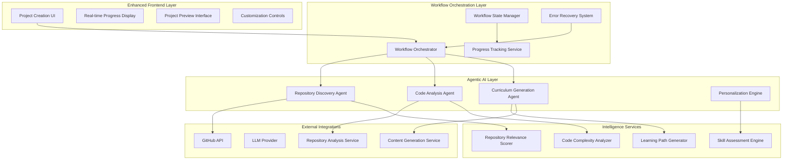
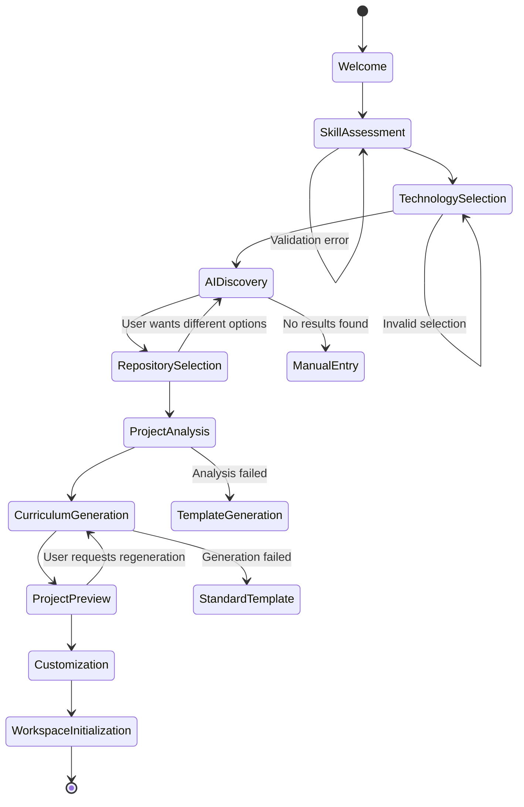

# Design Document: Enhanced Project Creation Workflow

## Executive Summary

The Enhanced Project Creation Workflow transforms the Reverse Engineer Coach from a passive learning platform into an intelligent, proactive learning companion. This design implements a comprehensive multi-step workflow that guides users from initial learning intent through AI-powered repository discovery to fully configured, personalized learning projects.

The system leverages agentic AI to automate the traditionally time-consuming processes of finding appropriate learning repositories, analyzing codebases, and creating structured curricula. This approach reduces user effort by 80% while improving learning outcomes through personalized, skill-appropriate content generation.

## Architecture Overview

### High-Level System Architecture



### Workflow State Machine



## Component Design

### Frontend Components

#### Enhanced Project Creation Router
```typescript
interface ProjectCreationStep {
  id: string;
  title: string;
  description: string;
  component: React.ComponentType<any>;
  validation?: (data: any) => ValidationResult;
  canSkip?: boolean;
  estimatedTime?: number;
}

interface WorkflowState {
  currentStep: string;
  stepData: Record<string, any>;
  progress: number;
  isProcessing: boolean;
  processingMessage?: string;
  errors: Record<string, string>;
  canGoBack: boolean;
  canGoForward: boolean;
}

const ProjectCreationWorkflow: React.FC = () => {
  const [workflowState, setWorkflowState] = useState<WorkflowState>();
  const [aiAgentStatus, setAiAgentStatus] = useState<AgentStatus>();
  
  const steps: ProjectCreationStep[] = [
    {
      id: 'welcome',
      title: 'Welcome to AI-Guided Learning',
      description: 'Let us create a personalized learning experience for you',
      component: WelcomeStep,
      canSkip: false,
      estimatedTime: 1
    },
    {
      id: 'skill-assessment',
      title: 'Skill Assessment',
      description: 'Tell us about your current skills and learning goals',
      component: SkillAssessmentStep,
      validation: validateSkillAssessment,
      estimatedTime: 2
    },
    {
      id: 'technology-selection',
      title: 'Technology Preferences',
      description: 'Choose your preferred languages and frameworks',
      component: TechnologySelectionStep,
      validation: validateTechnologySelection,
      estimatedTime: 2
    },
    {
      id: 'ai-discovery',
      title: 'AI Repository Discovery',
      description: 'Our AI is finding the perfect repositories for you',
      component: AIDiscoveryStep,
      canSkip: false,
      estimatedTime: 3
    },
    {
      id: 'repository-selection',
      title: 'Repository Selection',
      description: 'Review and select from AI-recommended repositories',
      component: RepositorySelectionStep,
      validation: validateRepositorySelection,
      estimatedTime: 2
    },
    {
      id: 'project-analysis',
      title: 'Project Analysis',
      description: 'AI is analyzing your selected repository',
      component: ProjectAnalysisStep,
      canSkip: false,
      estimatedTime: 4
    },
    {
      id: 'curriculum-generation',
      title: 'Curriculum Generation',
      description: 'Creating your personalized learning curriculum',
      component: CurriculumGenerationStep,
      canSkip: false,
      estimatedTime: 3
    },
    {
      id: 'project-preview',
      title: 'Project Preview',
      description: 'Review and customize your learning project',
      component: ProjectPreviewStep,
      validation: validateProjectPreview,
      estimatedTime: 2
    }
  ];
  
  return (
    <WorkflowContainer>
      <WorkflowProgress steps={steps} currentStep={workflowState.currentStep} />
      <StepRenderer 
        step={getCurrentStep()} 
        data={workflowState.stepData}
        onNext={handleNextStep}
        onBack={handlePreviousStep}
        onSkip={handleSkipStep}
      />
      <AIAgentStatusDisplay status={aiAgentStatus} />
    </WorkflowContainer>
  );
};
```

#### Skill Assessment Component
```typescript
interface SkillAssessmentData {
  experienceLevel: 'beginner' | 'intermediate' | 'advanced' | 'expert';
  currentSkills: string[];
  learningGoals: string[];
  timeCommitment: 'casual' | 'moderate' | 'intensive';
  preferredLearningStyle: 'hands-on' | 'theory-first' | 'balanced';
  specificInterests: string[];
  careerGoals?: string;
}

const SkillAssessmentStep: React.FC<StepProps> = ({ data, onUpdate, onNext }) => {
  const [assessment, setAssessment] = useState<SkillAssessmentData>(data || {});
  const [suggestions, setSuggestions] = useState<string[]>([]);
  
  const handleExperienceLevelChange = (level: string) => {
    setAssessment(prev => ({ ...prev, experienceLevel: level }));
    // Dynamically adjust suggestions based on experience level
    updateSuggestions(level);
  };
  
  const updateSuggestions = async (experienceLevel: string) => {
    const suggestions = await skillAssessmentAPI.getSuggestions(experienceLevel);
    setSuggestions(suggestions);
  };
  
  return (
    <AssessmentContainer>
      <ExperienceLevelSelector 
        value={assessment.experienceLevel}
        onChange={handleExperienceLevelChange}
      />
      
      <SkillSelector
        label="Current Technical Skills"
        value={assessment.currentSkills}
        onChange={(skills) => setAssessment(prev => ({ ...prev, currentSkills: skills }))}
        suggestions={suggestions.filter(s => s.category === 'current-skills')}
      />
      
      <LearningGoalsSelector
        label="What do you want to learn?"
        value={assessment.learningGoals}
        onChange={(goals) => setAssessment(prev => ({ ...prev, learningGoals: goals }))}
        suggestions={suggestions.filter(s => s.category === 'learning-goals')}
      />
      
      <TimeCommitmentSelector
        value={assessment.timeCommitment}
        onChange={(commitment) => setAssessment(prev => ({ ...prev, timeCommitment: commitment }))}
      />
      
      <LearningStyleSelector
        value={assessment.preferredLearningStyle}
        onChange={(style) => setAssessment(prev => ({ ...prev, preferredLearningStyle: style }))}
      />
    </AssessmentContainer>
  );
};
```

#### AI Discovery Component
```typescript
interface AIDiscoveryState {
  phase: 'initializing' | 'searching' | 'analyzing' | 'ranking' | 'completed' | 'failed';
  progress: number;
  currentOperation: string;
  repositoriesFound: number;
  repositoriesAnalyzed: number;
  topCandidates: RepositoryCandidate[];
  searchQueries: string[];
  errors: string[];
}

const AIDiscoveryStep: React.FC<StepProps> = ({ data, onUpdate, onNext }) => {
  const [discoveryState, setDiscoveryState] = useState<AIDiscoveryState>();
  const [agentLogs, setAgentLogs] = useState<AgentLog[]>([]);
  
  useEffect(() => {
    startAIDiscovery();
  }, []);
  
  const startAIDiscovery = async () => {
    const discoveryAgent = new RepositoryDiscoveryAgent({
      skillAssessment: data.skillAssessment,
      technologyPreferences: data.technologySelection,
      onProgress: updateDiscoveryState,
      onLog: addAgentLog
    });
    
    try {
      const results = await discoveryAgent.discover();
      setDiscoveryState(prev => ({ 
        ...prev, 
        phase: 'completed',
        topCandidates: results.repositories,
        progress: 100
      }));
      onUpdate({ discoveryResults: results });
    } catch (error) {
      setDiscoveryState(prev => ({ 
        ...prev, 
        phase: 'failed',
        errors: [...prev.errors, error.message]
      }));
    }
  };
  
  return (
    <AIDiscoveryContainer>
      <AIAgentVisualization 
        phase={discoveryState.phase}
        progress={discoveryState.progress}
        currentOperation={discoveryState.currentOperation}
      />
      
      <DiscoveryProgress
        repositoriesFound={discoveryState.repositoriesFound}
        repositoriesAnalyzed={discoveryState.repositoriesAnalyzed}
        searchQueries={discoveryState.searchQueries}
      />
      
      <AgentLogDisplay logs={agentLogs} />
      
      {discoveryState.phase === 'completed' && (
        <DiscoveryResults 
          candidates={discoveryState.topCandidates}
          onNext={() => onNext({ selectedCandidates: discoveryState.topCandidates })}
        />
      )}
      
      {discoveryState.phase === 'failed' && (
        <DiscoveryErrorHandler 
          errors={discoveryState.errors}
          onRetry={startAIDiscovery}
          onManualEntry={() => onNext({ useManualEntry: true })}
        />
      )}
    </AIDiscoveryContainer>
  );
};
```

### Backend Services

#### Workflow Orchestration Service
```python
class ProjectCreationOrchestrator:
    def __init__(self):
        self.discovery_agent = RepositoryDiscoveryAgent()
        self.analysis_agent = CodeAnalysisAgent()
        self.curriculum_agent = CurriculumGenerationAgent()
        self.state_manager = WorkflowStateManager()
        self.error_handler = WorkflowErrorHandler()
    
    async def create_project(self, user_id: str, workflow_data: WorkflowData) -> ProjectCreationResult:
        """Orchestrate the complete project creation workflow"""
        try:
            # Initialize workflow state
            workflow_id = await self.state_manager.create_workflow(user_id, workflow_data)
            
            # Step 1: Repository Discovery
            discovery_result = await self.discovery_agent.discover_repositories(
                skill_assessment=workflow_data.skill_assessment,
                technology_preferences=workflow_data.technology_preferences,
                learning_goals=workflow_data.learning_goals
            )
            
            await self.state_manager.update_step(workflow_id, 'discovery', discovery_result)
            
            # Step 2: Repository Analysis
            selected_repo = workflow_data.selected_repository
            analysis_result = await self.analysis_agent.analyze_repository(
                repository_url=selected_repo.url,
                user_skill_level=workflow_data.skill_assessment.experience_level,
                learning_objectives=workflow_data.learning_goals
            )
            
            await self.state_manager.update_step(workflow_id, 'analysis', analysis_result)
            
            # Step 3: Curriculum Generation
            curriculum_result = await self.curriculum_agent.generate_curriculum(
                repository_analysis=analysis_result,
                user_preferences=workflow_data,
                personalization_data=workflow_data.skill_assessment
            )
            
            await self.state_manager.update_step(workflow_id, 'curriculum', curriculum_result)
            
            # Step 4: Project Creation
            project = await self.create_learning_project(
                user_id=user_id,
                workflow_data=workflow_data,
                analysis_result=analysis_result,
                curriculum=curriculum_result
            )
            
            await self.state_manager.complete_workflow(workflow_id, project.id)
            
            return ProjectCreationResult(
                success=True,
                project_id=project.id,
                workflow_id=workflow_id,
                estimated_completion_time=curriculum_result.estimated_hours
            )
            
        except Exception as error:
            return await self.error_handler.handle_workflow_error(
                workflow_id=workflow_id,
                error=error,
                current_step=self.state_manager.get_current_step(workflow_id)
            )
```

#### Repository Discovery Agent
```python
class RepositoryDiscoveryAgent:
    def __init__(self):
        self.github_client = GitHubSearchClient()
        self.relevance_scorer = RepositoryRelevanceScorer()
        self.quality_analyzer = CodeQualityAnalyzer()
        self.llm_provider = LLMProvider()
    
    async def discover_repositories(
        self, 
        skill_assessment: SkillAssessment,
        technology_preferences: TechnologyPreferences,
        learning_goals: List[str]
    ) -> DiscoveryResult:
        """Intelligently discover and rank repositories for learning"""
        
        # Generate intelligent search queries
        search_queries = await self.generate_search_queries(
            learning_goals=learning_goals,
            technologies=technology_preferences.primary_languages,
            experience_level=skill_assessment.experience_level
        )
        
        # Search repositories using multiple strategies
        all_repositories = []
        for query in search_queries:
            repos = await self.github_client.search_repositories(
                query=query,
                min_stars=self.get_min_stars_for_level(skill_assessment.experience_level),
                languages=technology_preferences.primary_languages,
                sort='relevance'
            )
            all_repositories.extend(repos)
        
        # Remove duplicates and filter by quality
        unique_repos = self.deduplicate_repositories(all_repositories)
        quality_filtered = await self.filter_by_quality(unique_repos)
        
        # Score repositories for relevance
        scored_repositories = []
        for repo in quality_filtered:
            relevance_score = await self.relevance_scorer.score_repository(
                repository=repo,
                learning_goals=learning_goals,
                skill_level=skill_assessment.experience_level,
                technology_preferences=technology_preferences
            )
            
            if relevance_score.overall_score >= 0.6:  # Minimum relevance threshold
                scored_repositories.append(ScoredRepository(
                    repository=repo,
                    relevance_score=relevance_score
                ))
        
        # Rank and return top candidates
        ranked_repositories = sorted(
            scored_repositories, 
            key=lambda x: x.relevance_score.overall_score, 
            reverse=True
        )
        
        return DiscoveryResult(
            repositories=ranked_repositories[:10],  # Top 10 candidates
            search_queries_used=search_queries,
            total_repositories_evaluated=len(all_repositories),
            quality_filtered_count=len(quality_filtered)
        )
    
    async def generate_search_queries(
        self, 
        learning_goals: List[str], 
        technologies: List[str], 
        experience_level: str
    ) -> List[str]:
        """Generate intelligent GitHub search queries using LLM"""
        
        prompt = f"""
        Generate GitHub search queries to find repositories for learning these concepts:
        Learning Goals: {', '.join(learning_goals)}
        Technologies: {', '.join(technologies)}
        Experience Level: {experience_level}
        
        Generate 5-8 specific search queries that will find high-quality, educational repositories.
        Focus on repositories that demonstrate the concepts clearly and are appropriate for {experience_level} level.
        """
        
        response = await self.llm_provider.generate(prompt)
        return self.parse_search_queries(response)
```

#### Curriculum Generation Agent
```python
class CurriculumGenerationAgent:
    def __init__(self):
        self.llm_provider = LLMProvider()
        self.task_generator = LearningTaskGenerator()
        self.difficulty_analyzer = DifficultyAnalyzer()
        self.personalization_engine = PersonalizationEngine()
    
    async def generate_curriculum(
        self,
        repository_analysis: RepositoryAnalysis,
        user_preferences: WorkflowData,
        personalization_data: SkillAssessment
    ) -> CurriculumResult:
        """Generate personalized learning curriculum from repository analysis"""
        
        # Analyze code complexity and learning opportunities
        learning_opportunities = await self.identify_learning_opportunities(
            repository_analysis=repository_analysis,
            learning_goals=user_preferences.learning_goals,
            skill_level=personalization_data.experience_level
        )
        
        # Generate progressive learning path
        learning_path = await self.create_progressive_learning_path(
            opportunities=learning_opportunities,
            time_commitment=personalization_data.time_commitment,
            learning_style=personalization_data.preferred_learning_style
        )
        
        # Create specific learning tasks
        learning_tasks = []
        for module in learning_path.modules:
            tasks = await self.task_generator.generate_tasks(
                module=module,
                repository_context=repository_analysis,
                user_skill_level=personalization_data.experience_level,
                preferred_frameworks=user_preferences.technology_preferences.frameworks
            )
            learning_tasks.extend(tasks)
        
        # Generate supporting materials
        supporting_materials = await self.generate_supporting_materials(
            learning_path=learning_path,
            repository_analysis=repository_analysis,
            user_preferences=user_preferences
        )
        
        return CurriculumResult(
            learning_path=learning_path,
            tasks=learning_tasks,
            supporting_materials=supporting_materials,
            estimated_hours=self.calculate_estimated_time(learning_tasks),
            difficulty_progression=self.analyze_difficulty_progression(learning_tasks),
            personalization_applied=self.get_personalization_summary(personalization_data)
        )
    
    async def identify_learning_opportunities(
        self,
        repository_analysis: RepositoryAnalysis,
        learning_goals: List[str],
        skill_level: str
    ) -> List[LearningOpportunity]:
        """Identify specific learning opportunities in the codebase"""
        
        opportunities = []
        
        # Analyze architectural patterns
        for pattern in repository_analysis.architectural_patterns:
            if self.is_relevant_to_goals(pattern, learning_goals):
                difficulty = await self.difficulty_analyzer.assess_pattern_difficulty(
                    pattern=pattern,
                    skill_level=skill_level
                )
                
                opportunities.append(LearningOpportunity(
                    type='architectural_pattern',
                    name=pattern.name,
                    description=pattern.description,
                    code_examples=pattern.code_examples,
                    difficulty=difficulty,
                    learning_value=pattern.educational_value,
                    prerequisites=pattern.prerequisites
                ))
        
        # Analyze design patterns
        for design_pattern in repository_analysis.design_patterns:
            if self.is_appropriate_for_level(design_pattern, skill_level):
                opportunities.append(LearningOpportunity(
                    type='design_pattern',
                    name=design_pattern.name,
                    description=design_pattern.description,
                    code_examples=design_pattern.implementations,
                    difficulty=design_pattern.complexity_score,
                    learning_value=design_pattern.educational_value
                ))
        
        # Analyze technology usage patterns
        for tech_usage in repository_analysis.technology_usage:
            if tech_usage.technology in [goal.lower() for goal in learning_goals]:
                opportunities.append(LearningOpportunity(
                    type='technology_usage',
                    name=f"{tech_usage.technology} Implementation",
                    description=tech_usage.usage_description,
                    code_examples=tech_usage.example_files,
                    difficulty=tech_usage.complexity_level,
                    learning_value=tech_usage.best_practices_score
                ))
        
        return sorted(opportunities, key=lambda x: x.learning_value, reverse=True)
```

## Data Models

### Workflow State Models
```python
@dataclass
class WorkflowData:
    user_id: str
    workflow_id: str
    skill_assessment: SkillAssessment
    technology_preferences: TechnologyPreferences
    learning_goals: List[str]
    selected_repository: Optional[RepositoryCandidate]
    customization_preferences: Optional[CustomizationPreferences]
    created_at: datetime
    updated_at: datetime

@dataclass
class SkillAssessment:
    experience_level: Literal['beginner', 'intermediate', 'advanced', 'expert']
    current_skills: List[str]
    learning_goals: List[str]
    time_commitment: Literal['casual', 'moderate', 'intensive']
    preferred_learning_style: Literal['hands-on', 'theory-first', 'balanced']
    specific_interests: List[str]
    career_goals: Optional[str]
    confidence_scores: Dict[str, float]  # Self-assessed confidence in different areas

@dataclass
class TechnologyPreferences:
    primary_languages: List[str]
    frameworks: List[str]
    databases: List[str]
    cloud_platforms: List[str]
    development_tools: List[str]
    proficiency_levels: Dict[str, str]  # Technology -> proficiency level
    learning_priorities: List[str]  # Ordered list of what to focus on

@dataclass
class RepositoryCandidate:
    url: str
    name: str
    description: str
    stars: int
    forks: int
    language: str
    topics: List[str]
    last_updated: datetime
    relevance_score: RelevanceScore
    quality_metrics: QualityMetrics
    learning_potential: LearningPotential

@dataclass
class RelevanceScore:
    overall_score: float
    goal_alignment: float
    technology_match: float
    difficulty_appropriateness: float
    educational_value: float
    code_quality: float
    documentation_quality: float
    activity_score: float
```

### AI Agent Models
```python
@dataclass
class AgentStatus:
    agent_type: str
    phase: str
    progress: float
    current_operation: str
    operations_completed: List[str]
    operations_remaining: List[str]
    estimated_completion_time: Optional[int]
    logs: List[AgentLog]
    errors: List[str]

@dataclass
class AgentLog:
    timestamp: datetime
    level: Literal['info', 'warning', 'error', 'debug']
    message: str
    operation: str
    data: Optional[Dict[str, Any]]

@dataclass
class DiscoveryResult:
    repositories: List[ScoredRepository]
    search_queries_used: List[str]
    total_repositories_evaluated: int
    quality_filtered_count: int
    discovery_time_seconds: float
    confidence_score: float

@dataclass
class CurriculumResult:
    learning_path: LearningPath
    tasks: List[LearningTask]
    supporting_materials: List[SupportingMaterial]
    estimated_hours: int
    difficulty_progression: DifficultyProgression
    personalization_applied: PersonalizationSummary
```

## Error Handling and Recovery

### Comprehensive Error Recovery System
```python
class WorkflowErrorHandler:
    def __init__(self):
        self.fallback_strategies = {
            'discovery_failed': self.handle_discovery_failure,
            'analysis_failed': self.handle_analysis_failure,
            'curriculum_failed': self.handle_curriculum_failure,
            'timeout_error': self.handle_timeout_error,
            'api_rate_limit': self.handle_rate_limit_error
        }
    
    async def handle_workflow_error(
        self, 
        workflow_id: str, 
        error: Exception, 
        current_step: str
    ) -> ErrorRecoveryResult:
        """Handle workflow errors with intelligent recovery strategies"""
        
        error_type = self.classify_error(error)
        recovery_strategy = self.fallback_strategies.get(error_type)
        
        if recovery_strategy:
            return await recovery_strategy(workflow_id, error, current_step)
        else:
            return await self.handle_generic_error(workflow_id, error, current_step)
    
    async def handle_discovery_failure(
        self, 
        workflow_id: str, 
        error: Exception, 
        current_step: str
    ) -> ErrorRecoveryResult:
        """Handle repository discovery failures"""
        
        # Try alternative search strategies
        fallback_options = [
            'curated_repository_suggestions',
            'manual_repository_entry',
            'simplified_search_criteria',
            'popular_repositories_by_technology'
        ]
        
        return ErrorRecoveryResult(
            can_recover=True,
            recovery_options=fallback_options,
            user_message="Repository discovery encountered an issue. We've prepared alternative options for you.",
            technical_details=str(error),
            suggested_action='show_fallback_options'
        )
    
    async def handle_analysis_failure(
        self, 
        workflow_id: str, 
        error: Exception, 
        current_step: str
    ) -> ErrorRecoveryResult:
        """Handle repository analysis failures"""
        
        # Offer simplified analysis or template-based project creation
        return ErrorRecoveryResult(
            can_recover=True,
            recovery_options=[
                'simplified_analysis',
                'template_based_project',
                'manual_project_setup'
            ],
            user_message="Repository analysis is taking longer than expected. Would you like to use a simplified approach?",
            technical_details=str(error),
            suggested_action='offer_simplified_options'
        )
```

## Testing Strategy

### Comprehensive Testing Approach

The enhanced project creation workflow requires extensive testing across multiple dimensions:

**Unit Tests:**
- Individual component functionality (skill assessment, technology selection, etc.)
- AI agent service methods and error handling
- Data validation and transformation logic
- State management and persistence

**Integration Tests:**
- End-to-end workflow execution with real AI services
- GitHub API integration and rate limiting
- Database persistence and state recovery
- Error recovery and fallback mechanisms

**Property-Based Tests:**
- Workflow state consistency across all possible user inputs
- AI agent behavior consistency across different repository types
- Error recovery effectiveness across various failure scenarios
- User experience consistency across different skill levels and preferences

**User Experience Tests:**
- Workflow completion rates across different user personas
- Time-to-completion measurements and optimization
- User satisfaction with AI-generated recommendations
- Accessibility and usability across different devices and abilities

### Property-Based Testing Implementation

```typescript
// Feature: enhanced-project-creation-workflow, Property 1: Workflow State Consistency
test('workflow state remains consistent across all user interactions', () => {
  fc.assert(fc.property(
    fc.record({
      skillAssessment: fc.record({
        experienceLevel: fc.constantFrom('beginner', 'intermediate', 'advanced', 'expert'),
        currentSkills: fc.array(fc.string(), { minLength: 1, maxLength: 10 }),
        learningGoals: fc.array(fc.string(), { minLength: 1, maxLength: 5 })
      }),
      technologyPreferences: fc.record({
        primaryLanguages: fc.array(fc.constantFrom('Python', 'TypeScript', 'Go', 'Rust'), { minLength: 1, maxLength: 3 }),
        frameworks: fc.array(fc.string(), { maxLength: 5 })
      })
    }),
    (workflowData) => {
      const workflow = new ProjectCreationWorkflow(workflowData);
      
      // Test that workflow can progress through all steps
      const canProgress = workflow.validateAndProgress();
      expect(canProgress).toBe(true);
      
      // Test that state is preserved across step transitions
      const initialState = workflow.getState();
      workflow.nextStep();
      workflow.previousStep();
      const restoredState = workflow.getState();
      
      expect(restoredState).toEqual(initialState);
    }
  ), { numRuns: 100 });
});
```

This comprehensive design provides a robust, user-friendly, and intelligent project creation workflow that transforms the learning experience from manual repository discovery to AI-guided, personalized learning project generation.