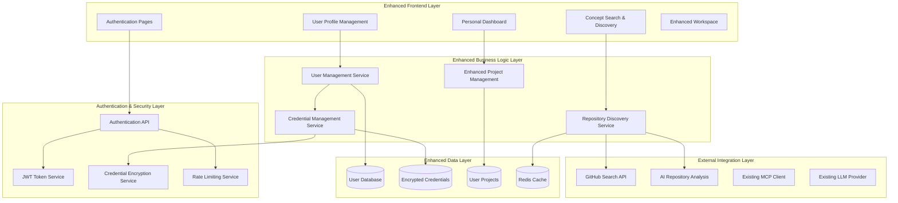
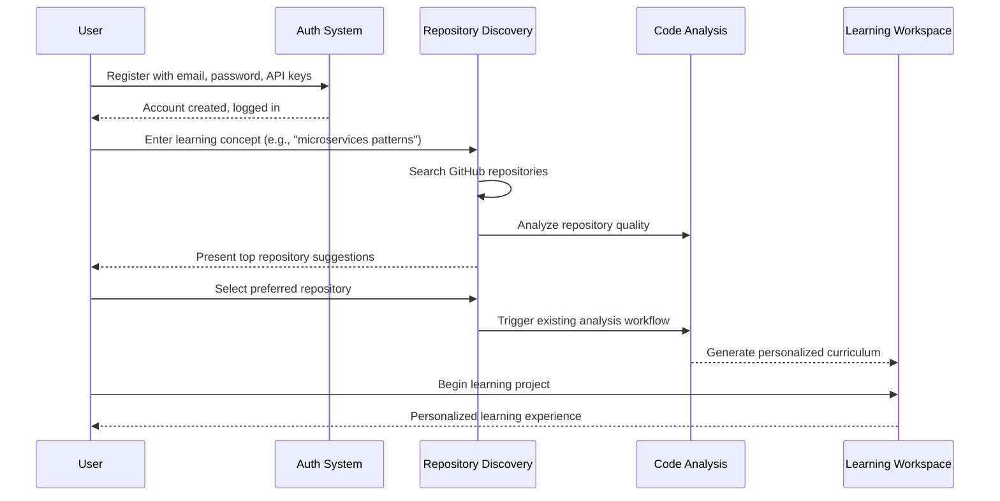

# Enhanced User System Design Document

## Executive Summary

The Enhanced User System transforms the Reverse Engineer Coach from a single-user application into a secure, multi-tenant platform with personalized learning experiences. This design introduces comprehensive user authentication, encrypted API credential management, intelligent repository discovery, and enhanced user experience improvements that maintain the platform's core educational value while adding enterprise-grade security and personalization.

## System Architecture Overview

### High-Level Architecture



### Enhanced User Flow Architecture



## Core Components Design

### 1. User Authentication System

#### Authentication Service
```python
class AuthenticationService:
    def __init__(self, db: Database, encryption: EncryptionService):
        self.db = db
        self.encryption = encryption
        self.jwt_service = JWTService()
    
    def register_user(self, registration_data: UserRegistration) -> AuthResult:
        # Validate email and password strength
        # Hash password with bcrypt
        # Encrypt API credentials
        # Create user record
        # Generate JWT token
        pass
    
    def authenticate_user(self, email: str, password: str) -> AuthResult:
        # Verify credentials
        # Generate JWT token
        # Update last login
        pass
    
    def refresh_token(self, refresh_token: str) -> AuthResult:
        # Validate refresh token
        # Generate new access token
        pass
```

#### User Model Enhancement
```python
@dataclass
class User:
    id: str
    email: str
    password_hash: str
    created_at: datetime
    updated_at: datetime
    last_login: Optional[datetime]
    is_active: bool = True

@dataclass
class UserCredentials:
    user_id: str
    github_token_encrypted: str
    ai_api_key_encrypted: str
    encryption_key_hash: str
    created_at: datetime
    updated_at: datetime
```

### 2. Secure Credential Management

#### Encryption Service
```python
class CredentialEncryptionService:
    def __init__(self, master_key: str):
        self.master_key = master_key
    
    def encrypt_credential(self, credential: str, user_salt: str) -> str:
        # Generate user-specific encryption key
        # Encrypt credential using AES-256
        # Return encrypted value
        pass
    
    def decrypt_credential(self, encrypted_credential: str, user_salt: str) -> str:
        # Generate user-specific decryption key
        # Decrypt credential
        # Return plaintext value
        pass
    
    def validate_github_token(self, token: str) -> bool:
        # Test GitHub API access with token
        pass
    
    def validate_ai_api_key(self, api_key: str) -> bool:
        # Test AI service access with key
        pass
```

### 3. Repository Discovery System

#### Discovery Service
```python
class RepositoryDiscoveryService:
    def __init__(self, github_client: GitHubClient, ai_analyzer: AIAnalyzer):
        self.github = github_client
        self.ai_analyzer = ai_analyzer
        self.cache = CacheService()
    
    def discover_repositories(self, learning_concept: str, user_id: str) -> List[RepositorySuggestion]:
        # Parse learning concept into search terms
        # Search GitHub with advanced filters
        # Analyze repository quality and educational value
        # Rank repositories by learning potential
        # Cache results for performance
        pass
    
    def analyze_repository_quality(self, repo_url: str) -> QualityScore:
        # Analyze README quality
        # Check code structure and documentation
        # Evaluate architectural complexity
        # Assess learning value using AI
        pass
```

#### Repository Suggestion Model
```python
@dataclass
class RepositorySuggestion:
    repository_url: str
    repository_name: str
    description: str
    stars: int
    language: str
    topics: List[str]
    quality_score: float
    educational_value: float
    relevance_score: float
    last_updated: datetime
    
    def overall_score(self) -> float:
        return (self.quality_score * 0.3 + 
                self.educational_value * 0.4 + 
                self.relevance_score * 0.3)
```

### 4. Enhanced User Interface Components

#### Registration Form Component
```typescript
interface RegistrationFormProps {
  onSubmit: (data: RegistrationData) => void;
  loading: boolean;
  errors: ValidationErrors;
}

interface RegistrationData {
  email: string;
  password: string;
  confirmPassword: string;
  githubToken: string;
  aiApiKey: string;
}

const RegistrationForm: React.FC<RegistrationFormProps> = ({
  onSubmit,
  loading,
  errors
}) => {
  // Form validation and submission logic
  // Password strength indicator
  // API credential validation
  // Error handling and display
};
```

#### Concept Search Component
```typescript
interface ConceptSearchProps {
  onConceptSubmit: (concept: string) => void;
  suggestions: string[];
  loading: boolean;
}

const ConceptSearchInput: React.FC<ConceptSearchProps> = ({
  onConceptSubmit,
  suggestions,
  loading
}) => {
  // Autocomplete functionality
  // Concept validation
  // Search suggestions
  // Loading states
};
```

#### Repository Discovery Component
```typescript
interface RepositoryDiscoveryProps {
  concept: string;
  suggestions: RepositorySuggestion[];
  onRepositorySelect: (repo: RepositorySuggestion) => void;
  loading: boolean;
}

const RepositoryDiscovery: React.FC<RepositoryDiscoveryProps> = ({
  concept,
  suggestions,
  onRepositorySelect,
  loading
}) => {
  // Display repository suggestions
  // Show quality and relevance scores
  // Repository preview information
  // Selection handling
};
```

### 5. Enhanced Project Management

#### User Project Service
```python
class UserProjectService:
    def __init__(self, db: Database, existing_project_service: ProjectService):
        self.db = db
        self.existing_service = existing_project_service
    
    def create_user_project(self, user_id: str, project_data: ProjectCreationData) -> UserProject:
        # Create project with user association
        # Initialize with user's API credentials
        # Set up user-specific workspace
        pass
    
    def get_user_projects(self, user_id: str, filters: ProjectFilters) -> List[UserProject]:
        # Retrieve user's projects with filtering
        # Apply pagination
        # Include progress information
        pass
    
    def delete_user_project(self, user_id: str, project_id: str) -> bool:
        # Verify ownership
        # Delete project data
        # Preserve anonymized analytics
        pass
```

## Database Schema Design

### Enhanced Database Schema

```sql
-- Users table
CREATE TABLE users (
    id UUID PRIMARY KEY DEFAULT gen_random_uuid(),
    email VARCHAR(255) UNIQUE NOT NULL,
    password_hash VARCHAR(255) NOT NULL,
    created_at TIMESTAMP DEFAULT CURRENT_TIMESTAMP,
    updated_at TIMESTAMP DEFAULT CURRENT_TIMESTAMP,
    last_login TIMESTAMP,
    is_active BOOLEAN DEFAULT true
);

-- User credentials table (encrypted)
CREATE TABLE user_credentials (
    id UUID PRIMARY KEY DEFAULT gen_random_uuid(),
    user_id UUID REFERENCES users(id) ON DELETE CASCADE,
    github_token_encrypted TEXT NOT NULL,
    ai_api_key_encrypted TEXT NOT NULL,
    encryption_key_hash VARCHAR(255) NOT NULL,
    created_at TIMESTAMP DEFAULT CURRENT_TIMESTAMP,
    updated_at TIMESTAMP DEFAULT CURRENT_TIMESTAMP
);

-- Enhanced learning projects table
ALTER TABLE learning_projects ADD COLUMN user_id UUID REFERENCES users(id);
ALTER TABLE learning_projects ADD COLUMN concept_description TEXT;
ALTER TABLE learning_projects ADD COLUMN discovery_metadata JSONB;

-- User sessions table
CREATE TABLE user_sessions (
    id UUID PRIMARY KEY DEFAULT gen_random_uuid(),
    user_id UUID REFERENCES users(id) ON DELETE CASCADE,
    token_hash VARCHAR(255) NOT NULL,
    expires_at TIMESTAMP NOT NULL,
    created_at TIMESTAMP DEFAULT CURRENT_TIMESTAMP
);

-- Repository discovery cache
CREATE TABLE repository_cache (
    id UUID PRIMARY KEY DEFAULT gen_random_uuid(),
    concept_hash VARCHAR(255) NOT NULL,
    repositories JSONB NOT NULL,
    created_at TIMESTAMP DEFAULT CURRENT_TIMESTAMP,
    expires_at TIMESTAMP NOT NULL
);

-- Indexes for performance
CREATE INDEX idx_users_email ON users(email);
CREATE INDEX idx_user_credentials_user_id ON user_credentials(user_id);
CREATE INDEX idx_learning_projects_user_id ON learning_projects(user_id);
CREATE INDEX idx_user_sessions_user_id ON user_sessions(user_id);
CREATE INDEX idx_user_sessions_token_hash ON user_sessions(token_hash);
CREATE INDEX idx_repository_cache_concept_hash ON repository_cache(concept_hash);
```

## Security Architecture

### Authentication Flow
1. **Registration**: Email validation, password hashing (bcrypt), API credential encryption
2. **Login**: Credential verification, JWT token generation, session creation
3. **Authorization**: JWT token validation, user context injection
4. **Logout**: Token invalidation, session cleanup

### Credential Security
- **Encryption**: AES-256 encryption for API credentials
- **Key Management**: User-specific encryption keys derived from master key + user salt
- **Storage**: Encrypted credentials stored separately from user data
- **Access**: Credentials decrypted only when needed for API calls

### API Security
- **Rate Limiting**: Prevent brute force attacks on authentication endpoints
- **Input Validation**: Sanitize all user inputs to prevent injection attacks
- **CORS**: Properly configured cross-origin resource sharing
- **HTTPS**: Enforce TLS encryption for all communications

## Integration Strategy

### Backward Compatibility
- Existing learning projects migrated to user-associated projects
- Current API endpoints enhanced with authentication middleware
- Existing frontend components wrapped with authentication context

### Migration Plan
1. **Phase 1**: Add user authentication system alongside existing functionality
2. **Phase 2**: Migrate existing data to user-associated model
3. **Phase 3**: Replace dropdown with concept search
4. **Phase 4**: Implement repository discovery
5. **Phase 5**: Deploy enhanced system

## Performance Considerations

### Caching Strategy
- **Repository Discovery**: Cache search results by concept hash
- **User Sessions**: Redis-based session storage
- **API Credentials**: In-memory caching of decrypted credentials (with TTL)

### Database Optimization
- **Indexing**: Strategic indexes on user_id, email, and frequently queried fields
- **Connection Pooling**: Efficient database connection management
- **Query Optimization**: User-scoped queries to prevent data leakage

### Scalability
- **Horizontal Scaling**: Stateless authentication service design
- **Load Balancing**: Session-independent request handling
- **Resource Isolation**: User-specific resource allocation and rate limiting

## Monitoring and Analytics

### Security Monitoring
- Failed authentication attempts
- Unusual API credential usage patterns
- Session anomalies and potential security breaches

### User Analytics
- Registration and activation rates
- Repository discovery success rates
- Learning project completion metrics
- User engagement and retention

### Performance Monitoring
- Authentication response times
- Repository discovery performance
- Database query performance
- API credential encryption/decryption latency

## Error Handling and Recovery

### Authentication Errors
- Invalid credentials: Clear error messages without information leakage
- Expired sessions: Automatic redirect to login with context preservation
- Rate limiting: Temporary lockout with clear recovery instructions

### Discovery Errors
- No repositories found: Alternative concept suggestions
- GitHub API failures: Fallback to cached results
- AI analysis failures: Basic repository ranking fallback

### Data Recovery
- User account recovery via email verification
- API credential reset functionality
- Project backup and restoration capabilities

This design maintains the educational value of the existing Reverse Engineer Coach while adding enterprise-grade user management, security, and personalization features that will significantly enhance the user experience and platform scalability.