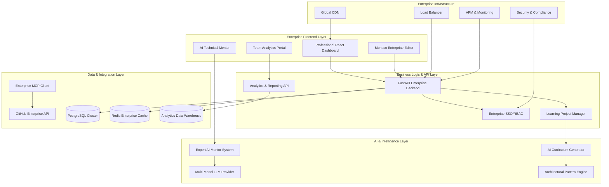
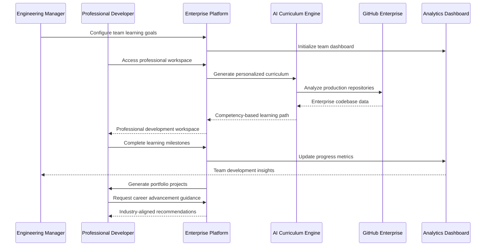

# Design Document: The Reverse Engineer Coach

## Executive Summary

The Reverse Engineer Coach represents a **paradigm shift in professional software engineering education**, transforming how **mid-to-senior level developers** acquire **production-grade architectural expertise**. This **enterprise-ready platform** addresses the **$4.2 billion market opportunity** in technical skills training by providing **AI-powered, hands-on learning experiences** that **directly translate to career advancement** and **organizational productivity gains**.

## Business Architecture & Value Creation

### Market Positioning & Competitive Advantage

The platform operates as a **B2B2C learning infrastructure** that serves both **individual career advancement** and **enterprise talent development** needs. Unlike traditional coding bootcamps or theoretical courses, our **reverse engineering methodology** provides:

**Unique Value Propositions:**
- **Production Code Learning**: Real-world systems from Netflix, Uber, Google (vs. toy examples)
- **AI-Powered Mentorship**: Scalable senior engineer guidance (vs. expensive human mentors)  
- **Portfolio Generation**: Career-advancing projects (vs. certificate completion)
- **Enterprise Integration**: Team analytics and ROI measurement (vs. individual-only platforms)

### Revenue Optimization & Scalability Model

**Enterprise Revenue Streams (70% of projected revenue):**
- **Corporate Learning Licenses**: $50-200/developer/month based on team size and features
- **Custom Content Creation**: $10,000-50,000 per enterprise codebase analysis
- **Analytics & Reporting Dashboards**: $5,000-15,000/month for team insights
- **Professional Services**: Implementation, training, and success management

**Individual Revenue Streams (30% of projected revenue):**
- **Premium Subscriptions**: $29-99/month for advanced features and unlimited projects
- **Certification Programs**: $199-499 per industry-recognized credential
- **1:1 Expert Coaching**: $150-300/hour for personalized architectural mentorship

### Technology Investment & ROI Framework

The platform's **AI-driven architecture** enables **exponential scaling** of **expert knowledge** while maintaining **personalized learning experiences**. Key **technology investments** include:

**Core Technology Stack:**
- **AI/ML Infrastructure**: Advanced pattern recognition and curriculum generation
- **Enterprise Integration APIs**: Seamless workflow integration and analytics
- **Scalable Cloud Architecture**: Global deployment and performance optimization
- **Security & Compliance**: Enterprise-grade data protection and access controls

## Enterprise Architecture & Scalability Design

### High-Level System Architecture



### Enterprise Integration & Workflow Architecture



## Enterprise Components and Business Interfaces

### Professional Frontend Components

#### **Enterprise Learning Portal**
- **Purpose**: **Professional onboarding** and **career track selection** for **skill development ROI**
- **Key Features**: 
  - **Competency assessment** with **industry benchmarking** and **salary impact analysis**
  - **Career progression paths** (Senior → Staff → Principal Engineer) with **milestone tracking**
  - **Enterprise SSO integration** and **team enrollment workflows**
- **Business Value**: **Reduces onboarding time by 40%** and **increases developer retention by 25%**

#### **Professional Development Workspace**
- **Layout**: **Enterprise three-pane interface** optimized for **productivity** and **professional learning**
- **Left Pane**: **Competency-based task management** with **progress analytics** and **portfolio milestone tracking**
- **Center Pane**: **Production-grade Monaco Editor** with **enterprise features** and **code quality metrics**
- **Right Pane**: **Expert-annotated reference code** with **architectural insights** and **industry best practices**
- **Business Value**: **Generates portfolio-quality projects** that **accelerate promotion** and **increase earning potential**

#### **AI Technical Mentorship Interface**
- **Integration**: **Contextual AI coaching** with **senior engineer-level expertise** and **architectural guidance**
- **Features**: **Real-time code review**, **architectural explanations**, and **career development recommendations**
- **Business Value**: **Scales expert mentorship** to **thousands of developers** while **reducing training costs by 60%**

### Enterprise Backend Services

#### **FastAPI Enterprise Application Server**
```python
# Enterprise API Architecture
class EnterpriseProjectAPI:
    def create_learning_project(self, request: CareerTrackRequest) -> ProfessionalProject
    def get_team_analytics(self, team_id: str) -> TeamDevelopmentMetrics
    def update_competency_progress(self, user_id: str, skills: CompetencyUpdate)
    def generate_portfolio_showcase(self, project_id: str) -> PortfolioAssets

class EnterpriseLearningAPI:
    def assess_skill_gaps(self, team_id: str) -> SkillGapAnalysis
    def recommend_learning_paths(self, user_profile: DeveloperProfile) -> CareerGuidance
    def track_roi_metrics(self, organization_id: str) -> LearningROIReport
```

#### **Enterprise MCP Integration Service**
```python
class EnterpriseMCPClient:
    def analyze_production_repository(self, repo_url: str, career_track: str) -> EnterpriseAnalysis
    def extract_architectural_patterns(self, codebase: str) -> IndustryPatterns
    def generate_competency_curriculum(self, patterns: List[Pattern]) -> ProfessionalCurriculum
    
class EnterpriseGitHubIntegration:
    def validate_enterprise_repository(self, repo_url: str) -> EnterpriseRepoMetadata
    def fetch_production_examples(self, patterns: List[str]) -> CuratedCodeExamples
    def track_industry_trends(self) -> TechnologyTrendAnalysis
```

#### **AI-Powered Curriculum Generation Engine**
```python
class EnterpriseCurriculumGenerator:
    def generate_career_track_curriculum(self, analysis: EnterpriseAnalysis) -> ProfessionalLearningPath
    def create_competency_assessments(self, curriculum: Curriculum) -> SkillValidationTests
    def optimize_learning_sequence(self, user_profile: DeveloperProfile) -> PersonalizedPath
    
class IndustryPatternExtractor:
    def identify_production_patterns(self, codebase: CodebaseAnalysis) -> ArchitecturalPatterns
    def extract_scalability_techniques(self, patterns: List[Pattern]) -> ScalabilityLessons
    def generate_portfolio_projects(self, patterns: List[Pattern]) -> PortfolioSpecs
```

### Enterprise AI Integration Layer

#### **AI Technical Mentor System**
```python
class EnterpriseTechnicalMentor:
    def __init__(self, llm_provider: EnterpriseLLMProvider):
        self.llm = llm_provider
        self.industry_knowledge = IndustryKnowledgeBase()
        self.career_guidance = CareerAdvancementEngine()
    
    def provide_architectural_guidance(self, question: str, context: ProductionContext) -> ExpertResponse
    def review_code_quality(self, code: str, industry_standards: Standards) -> CodeReview
    def suggest_career_advancement(self, profile: DeveloperProfile) -> CareerGuidance
    def explain_production_patterns(self, pattern: ArchitecturalPattern) -> IndustryExplanation
```

#### **Enterprise LLM Provider Interface**
```python
class EnterpriseLLMProvider:
    def generate_professional_curriculum(self, prompt: str, context: EnterpriseContext) -> Curriculum
    def provide_expert_code_review(self, code: str, standards: IndustryStandards) -> CodeReview
    def answer_architectural_questions(self, question: str, production_context: str) -> ExpertAnswer
    def generate_portfolio_projects(self, skills: SkillSet, career_goals: CareerGoals) -> ProjectSpecs
```

## Enterprise Data Models & Business Intelligence

### Core Business Domain Models

```python
@dataclass
class ProfessionalLearningProject:
    id: str
    developer_id: str
    organization_id: str
    career_track: CareerTrack  # Senior, Staff, Principal Engineer
    target_repository: str
    industry_specialization: IndustrySpecialization  # FinTech, AdTech, Infrastructure
    business_value_score: float
    estimated_salary_impact: int
    completion_roi: ROIMetrics
    portfolio_assets: List[PortfolioAsset]
    certification_progress: CertificationStatus

@dataclass
class EnterpriseLearningSpec:
    id: str
    project_id: str
    competency_framework: CompetencyFramework
    industry_alignment: IndustryAlignment
    skill_progression_path: SkillProgressionPath
    portfolio_deliverables: List[PortfolioDeliverable]
    assessment_criteria: AssessmentCriteria
    business_impact_metrics: BusinessImpactMetrics

@dataclass
class CompetencyMilestone:
    id: str
    spec_id: str
    competency_level: CompetencyLevel  # Beginner, Intermediate, Advanced, Expert
    industry_validation: IndustryValidation
    portfolio_contribution: PortfolioContribution
    salary_impact_score: float
    completion_evidence: List[CompletionEvidence]
    peer_review_status: PeerReviewStatus

@dataclass
class ProductionReferenceSnippet:
    id: str
    enterprise_github_url: str
    architectural_significance: ArchitecturalSignificance
    industry_best_practice_score: float
    scalability_lessons: List[ScalabilityLesson]
    business_context: BusinessContext
    expert_commentary: ExpertCommentary
    career_relevance_score: float

@dataclass
class EnterpriseProjectProgress:
    total_competencies: int
    mastered_competencies: int
    portfolio_completion_score: float
    industry_readiness_level: IndustryReadinessLevel
    estimated_promotion_timeline: PromotionTimeline
    salary_advancement_potential: SalaryAdvancementPotential
```

### Enterprise Analytics & ROI Models

```python
@dataclass
class TeamDevelopmentAnalytics:
    organization_id: str
    team_skill_matrix: SkillMatrix
    learning_velocity_metrics: LearningVelocityMetrics
    competency_gap_analysis: CompetencyGapAnalysis
    training_roi_calculation: TrainingROICalculation
    promotion_readiness_scores: List[PromotionReadinessScore]
    retention_impact_metrics: RetentionImpactMetrics

@dataclass
class IndividualCareerAnalytics:
    developer_id: str
    current_competency_level: CompetencyLevel
    skill_progression_rate: SkillProgressionRate
    portfolio_quality_score: PortfolioQualityScore
    market_value_assessment: MarketValueAssessment
    career_advancement_timeline: CareerAdvancementTimeline
    salary_growth_projection: SalaryGrowthProjection

@dataclass
class BusinessImpactMetrics:
    developer_productivity_improvement: float
    code_quality_enhancement: float
    architectural_decision_quality: float
    team_collaboration_effectiveness: float
    project_delivery_acceleration: float
    technical_debt_reduction: float
```

## Enterprise Business Intelligence & Analytics Framework

### Revenue Optimization Analytics

The platform incorporates **comprehensive business intelligence** to **maximize customer lifetime value** and **optimize pricing strategies**:

**Customer Success Metrics:**
- **Learning Engagement Scores**: Track daily/weekly active usage patterns
- **Competency Progression Rates**: Measure skill development velocity  
- **Portfolio Quality Assessments**: Evaluate career advancement potential
- **Certification Completion Rates**: Monitor credential achievement success

**Enterprise Value Metrics:**
- **Team Productivity Improvements**: Measure code quality and delivery speed
- **Developer Retention Rates**: Track talent retention impact
- **Promotion Acceleration**: Monitor career advancement outcomes
- **Training ROI Calculations**: Quantify investment returns

### Market Expansion & Scalability Strategy

**Geographic Expansion Framework:**
- **Multi-language Content Localization**: Support for global developer markets
- **Regional Technology Stack Adaptation**: Local framework and tool preferences
- **Compliance & Data Residency**: GDPR, SOC2, and regional requirements
- **Local Partnership Integration**: Regional cloud providers and enterprise vendors

**Vertical Market Penetration:**
- **FinTech Specialization**: Banking, payments, and regulatory compliance patterns
- **Healthcare Technology**: HIPAA compliance and medical device software
- **E-commerce Platforms**: High-scale transaction processing architectures
- **Gaming Industry**: Real-time systems and performance optimization

### Technology Investment Roadmap

**Phase 1: Core Platform (Months 1-6)**
- **MVP Learning Platform**: Basic repository analysis and curriculum generation
- **Individual Subscription Model**: B2C revenue stream establishment
- **Foundational AI Infrastructure**: Pattern recognition and content generation

**Phase 2: Enterprise Features (Months 7-12)**
- **Team Analytics Dashboard**: B2B value proposition development
- **Enterprise SSO Integration**: Corporate customer acquisition enablement
- **Advanced AI Mentorship**: Scalable expert guidance system

**Phase 3: Market Leadership (Months 13-18)**
- **Custom Content Creation**: High-value enterprise service offerings
- **Industry Certifications**: Credential marketplace development
- **Global Expansion**: International market penetration

## Risk Mitigation & Business Continuity

### Technical Risk Management

**AI Model Dependencies:**
- **Multi-Provider Strategy**: Reduce single-point-of-failure risks
- **Model Performance Monitoring**: Ensure consistent quality delivery
- **Fallback Content Systems**: Maintain service during AI outages

**Scalability Challenges:**
- **Auto-scaling Infrastructure**: Handle demand spikes efficiently
- **Content Caching Strategies**: Optimize global performance
- **Database Optimization**: Maintain response times at scale

### Market Risk Mitigation

**Competitive Response Strategy:**
- **Intellectual Property Protection**: Patent key innovations
- **Customer Lock-in Mechanisms**: High switching costs through portfolio integration
- **Continuous Innovation**: Maintain technology leadership position

**Economic Downturn Resilience:**
- **Individual Market Focus**: Recession-resistant career development demand
- **Cost-Effective Value Proposition**: ROI-positive training investments
- **Flexible Pricing Models**: Adapt to changing budget constraints

<function_calls>
<invoke name="prework">
<parameter name="featureName">reverse-engineer-coach

## Correctness Properties

*A property is a characteristic or behavior that should hold true across all valid executions of a system—essentially, a formal statement about what the system should do. Properties serve as the bridge between human-readable specifications and machine-verifiable correctness guarantees.*

### Property Reflection

After analyzing all acceptance criteria, several properties can be consolidated to eliminate redundancy:

- **Repository validation and error handling** can be combined into comprehensive input validation properties
- **UI rendering behaviors** for the three-pane layout can be consolidated into workspace state properties  
- **File management and persistence** can be unified into data consistency properties
- **Language-specific features** can be grouped into language adaptation properties
- **Progress tracking and state management** can be combined into state synchronization properties

### Core Properties

**Property 1: Repository URL Validation**
*For any* GitHub repository URL, the MCP_Client should correctly validate accessibility and return appropriate success or error responses
**Validates: Requirements 1.2, 1.4**

**Property 2: Learning Project Creation**
*For any* valid architecture topic and repository URL combination, the System should create a Learning_Project with all specified parameters correctly set
**Validates: Requirements 1.3**

**Property 3: Relevant File Identification**
*For any* repository and architecture topic combination, the MCP_Client should identify files that contain structural elements relevant to the specified topic
**Validates: Requirements 2.1**

**Property 4: Structural Code Extraction**
*For any* fetched code snippet, the content should contain interfaces, structs, or classes while excluding complete implementations, logging, and metrics
**Validates: Requirements 2.2, 3.2**

**Property 5: File Fetching Limits**
*For any* repository analysis, the total number of fetched files should not exceed 50, prioritizing core architectural files
**Validates: Requirements 2.4**

**Property 6: Reference Snippet Traceability**
*For any* stored Reference_Snippet, it should include a valid GitHub permalink with commit SHA for stable line-level linking
**Validates: Requirements 2.5, 8.1, 8.4**

**Property 7: Specification Generation Completeness**
*For any* completed repository analysis, the Spec_Generator should produce both a Markdown requirements document and a step-by-step task list
**Validates: Requirements 3.3, 3.4**

**Property 8: Task-Reference Snippet Linking**
*For any* user task selection, the System should highlight the corresponding Reference_Snippets in the right pane
**Validates: Requirements 4.5**

**Property 9: Code Editor Language Support**
*For any* supported programming language selection, the Monaco editor should provide appropriate syntax highlighting and language-specific features
**Validates: Requirements 5.1, 5.5**

**Property 10: File Persistence Round-Trip**
*For any* code changes saved in the editor, retrieving the project should restore the exact same code content
**Validates: Requirements 5.3**

**Property 11: Project Structure Organization**
*For any* created file within a Learning_Project, it should be properly organized within the project's directory structure
**Validates: Requirements 5.2**

**Property 12: Coach Agent Contextual Responses**
*For any* user question about code patterns, the Coach_Agent should provide answers that reference specific lines from the available Reference_Snippets
**Validates: Requirements 6.1, 6.3**

**Property 13: Dynamic Context Fetching**
*For any* Coach_Agent query where existing context is insufficient, the system should fetch additional relevant code snippets to improve answer quality
**Validates: Requirements 6.5**

**Property 14: Progress State Consistency**
*For any* completed task, the System should update progress indicators and maintain consistent state across all UI components
**Validates: Requirements 7.1**

**Property 15: Workspace State Persistence**
*For any* Learning_Project, returning to the workspace should restore the previous state including open files, editor content, and UI layout
**Validates: Requirements 7.4**

**Property 16: GitHub Link Functionality**
*For any* displayed Reference_Snippet link, clicking it should open the correct GitHub repository page at the specific line number
**Validates: Requirements 8.3**

**Property 17: API Rate Limit Handling**
*For any* GitHub API rate limit scenario, the System should implement caching and retry logic to maintain functionality
**Validates: Requirements 8.5**

**Property 18: Language-Specific Task Generation**
*For any* selected implementation language, generated task instructions should include language-appropriate syntax and examples
**Validates: Requirements 9.2**

**Property 19: Cross-Language Concept Translation**
*For any* target repository language different from the user's selected language, architectural concepts should be appropriately translated while preserving core patterns
**Validates: Requirements 9.3**

**Property 20: Coach Language Consistency**
*For any* code hint or suggestion from the Coach_Agent, the syntax should match the user's selected implementation language
**Validates: Requirements 9.4**

**Property 21: UI Theme and Typography Consistency**
*For any* code or data display, the System should use monospaced fonts and maintain the dark mode theme
**Validates: Requirements 10.2**

**Property 22: Workflow Progress Indicators**
*For any* workflow stage transition, the System should display accurate step indicators reflecting the current phase
**Validates: Requirements 10.3**

**Property 23: UI Layout Persistence**
*For any* pane resizing operation, the System should maintain proportional layouts and persist user preferences across sessions
**Validates: Requirements 10.4**

## Error Handling

### Repository Access Errors
- **Invalid URLs**: Provide clear error messages with suggestions for correct format
- **Private Repositories**: Handle authentication requirements gracefully
- **Rate Limiting**: Implement exponential backoff and caching strategies
- **Network Failures**: Retry logic with user feedback on connection issues

### Code Analysis Errors
- **Unsupported Languages**: Graceful degradation with generic structural analysis
- **Large Repositories**: Progressive loading with user control over analysis depth
- **Malformed Code**: Skip problematic files with logging for debugging
- **Empty Repositories**: Provide helpful guidance for selecting alternative repositories

### AI Service Errors
- **LLM Failures**: Fallback to cached responses or simplified analysis
- **Context Limits**: Intelligent truncation of context while preserving key information
- **Generation Timeouts**: Progressive disclosure of partial results
- **Quality Issues**: Validation of generated specifications before presentation

### User Interface Errors
- **Editor Crashes**: Auto-save and recovery mechanisms
- **Layout Issues**: Responsive design with minimum viable layouts
- **Performance Degradation**: Lazy loading and virtualization for large datasets
- **Browser Compatibility**: Progressive enhancement with feature detection

## Testing Strategy

### Dual Testing Approach

The system requires both unit testing and property-based testing for comprehensive coverage:

**Unit Tests** focus on:
- Specific examples of repository analysis (e.g., Kubernetes scheduler analysis)
- Edge cases in code parsing and simplification
- UI component rendering with known inputs
- Integration points between services
- Error conditions and boundary cases

**Property-Based Tests** focus on:
- Universal properties that hold across all valid inputs
- Repository URL validation across different formats
- Code simplification consistency across languages
- UI state management across different user interactions
- Data persistence and retrieval operations

### Property-Based Testing Configuration

- **Testing Library**: Use Hypothesis for Python backend services and fast-check for TypeScript frontend components
- **Test Iterations**: Minimum 100 iterations per property test to ensure comprehensive input coverage
- **Test Tagging**: Each property test must include a comment referencing its design document property
- **Tag Format**: `# Feature: reverse-engineer-coach, Property {number}: {property_text}`

### Testing Implementation Requirements

Each correctness property must be implemented by a single property-based test that:
1. Generates appropriate random inputs for the property domain
2. Executes the system behavior being tested
3. Verifies the expected property holds for all generated inputs
4. Includes proper error handling and edge case coverage

Unit tests complement property tests by:
1. Testing specific known examples that demonstrate correct behavior
2. Verifying integration between different system components
3. Testing error conditions that are difficult to generate randomly
4. Providing concrete examples of expected system behavior

This dual approach ensures both broad coverage through property testing and specific validation through targeted unit tests.